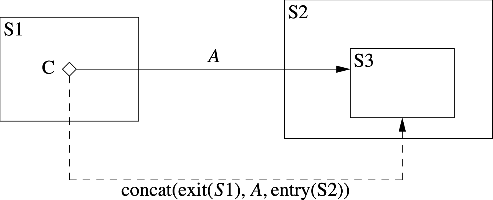
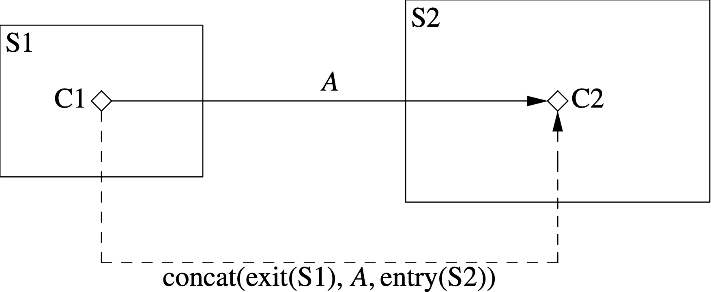

This algorithm flattens the choice transitions in a state machine
definition.
By flattening transitions, we simplify the code generation
and runtime logic.

== Input

. A state machine definition _smd_.

. A
https://github.com/nasa/fpp/wiki/State-Machine-Analysis-Data-Structure[state 
machine analysis data structure]
_sma_ representing the results of analysis so far.

== Output

. _sma_ with the
https://github.com/nasa/fpp/wiki/State-Machine-Analysis-Data-Structure[flattened 
choice transition map]
updated.

== Diagrams

The following diagrams illustrate how choice transitions are flattened.

=== Choice Transitions to States

<<choice-to-state,Figure 1>> shows how choice transitions to states are flattened.
S1 is a state with a choice C.
S2 is a state with a substate S3.
It has an initial transition specifier with actions _A'_ and
target S3.

The solid left-to-right arrow represents a transition _T_ in the hierarchical
state machine from C to S2 with actions _A_.
_T_ generates the flattened transition represented by the dashed arrow.
The action list for this transition is the concatenation
of the action lists shown.
In these lists,
exit(_S_) represents the list of exit functions specified by _S_,
and similarly for entry(_S_).

[#choice-to-state]
.Choice transitions to states.

Note that each flattened transition goes from a choice
to a leaf state.

=== Choice Transitions to Choices

<<choice-to-choice,Figure 2>> shows how choice transitions to choices are flattened.
S1 is a state with a choice C1.
S2 is a state with a choice C2.
The solid left-to-right arrow represents a transition _T_ in the hierarchical
state machine from C1 to C2.
_T_ generates the flattened transition represented by the dashed arrow.
The action list for this transition is the concatenation
of the action lists shown.

[#choice-to-choice]
.Choice transitions to choices.

== Procedure

Visit each of the choices in _smd_.

=== Visiting Choices

. Let _sd_ be the state definition being visited.

. For each choice definition _cd_ in _sd_

.. For each transition expression _e_ in _cd_

... Let _A_ be the actions of _e_.

... Let _soc_ be the state or choice that is the target of _e_.

... https://github.com/nasa/fpp/wiki/Constructing-Flattened-Transitions[Construct]
the transition _t_ from _cd_ to _soc_ with actions _A_

... Map _e_ to _t_ in the flattened choice transition map of _sma_.

