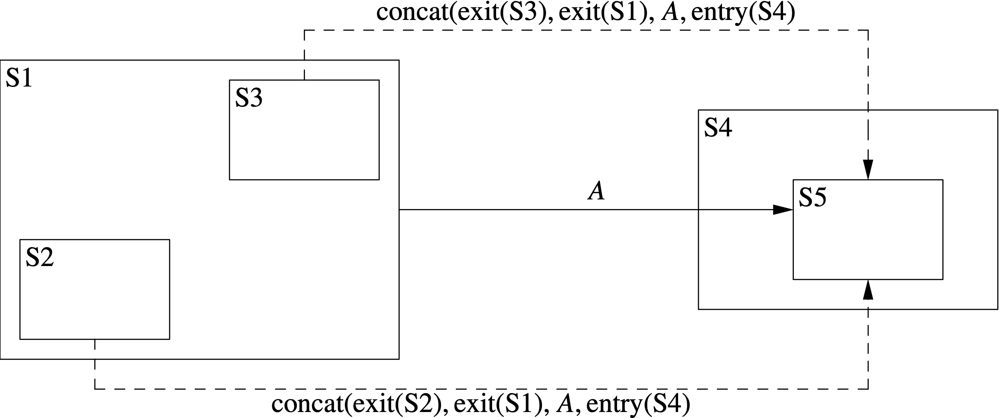
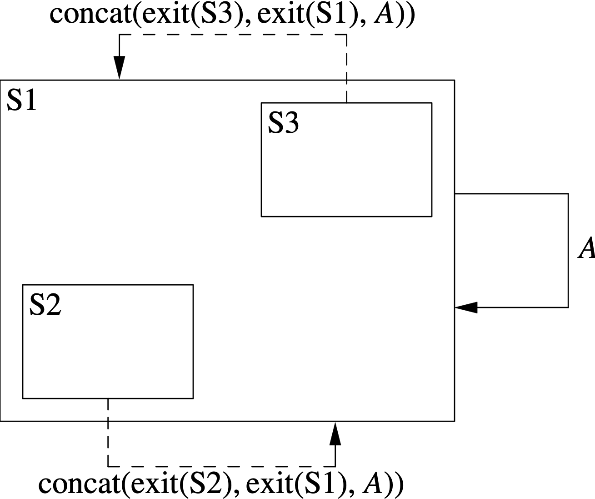
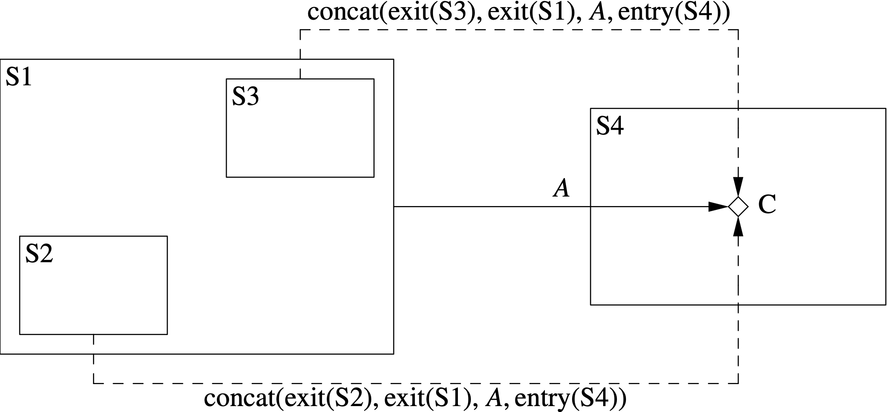
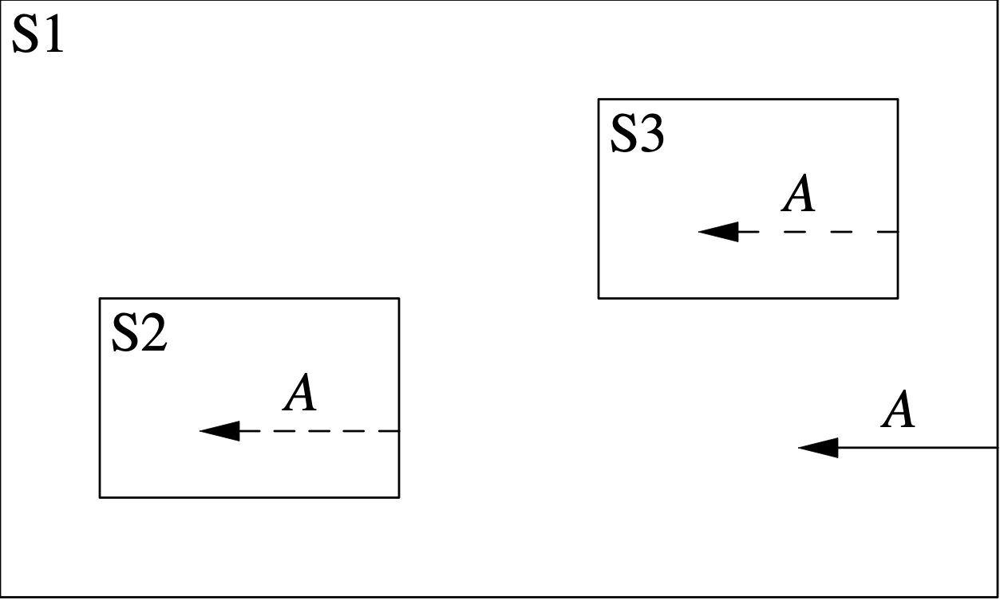

This algorithm flattens the state transitions in a state machine definition.
By flattening transitions, we simplify the code generation
and runtime logic.

== Input

. A state machine definition _smd_.

. A
https://github.com/nasa/fpp/wiki/State-Machine-Analysis-Data-Structure[state 
machine analysis data structure]
_sma_ representing the results of analysis so far.

== Output

. _sma_ with the
https://github.com/nasa/fpp/wiki/State-Machine-Analysis-Data-Structure[flattened 
state transition map]
updated.

== Diagrams

The following diagrams illustrate how state transitions are flattened.

=== State Transitions to States Other Than Parents of Self

<<state-to-state,Figure 1>> shows how transitions are flattened where,
after the flattening, the target state _T_ is not a transitive parent of
the source state _S_ (i.e., _T_ is not _S_, or a parent of _S_, or a parent
of a parent of _S_, etc.).
In this example, S1 is a state with substates S2 and S3.
S4 is a state with substate S5.

The solid left-to-right arrow represents a transition _T_ in the hierarchical
state machine from S1 to S5 with actions _A_.
_T_ generates each of the flattened transitions
represented by the dashed arrows.
Neither of the arrows goes from a state _S_ to a transitive parent of _S_.
For each dashed arrow, the action list is the concatenation
of the action lists shown.
In these lists,
exit(_S_) represents the list of exit functions specified by _S_,
and similarly for entry(_S_).

[#state-to-state]
.State transitions to states other than parents of self.

Note the following:

. Each flattened transition goes from a leaf
state but not necessarily to a leaf state.

. In general, _T_ generates the transitions out of S2 and S3 as shown.
However, if the hierarchical state machine specifies a
transition _T'_ out of S2,
and _T'_ is triggered by the same signal as _T_, then _T'_ overrides _T_;
and similarly for a transition _T''_ out of S3.
This rule is called *behavioral polymorphism*.

=== State Transitions to Parents of Self

<<state-to-state,Figure 2>> shows how transitions are flattened where,
after the flattening, the transition goes from a state _S_ to
a transitive parent of _S_.
Again S1 is a state with substates S2 and S3.

The solid clockwise arrow represents a transition _T_ in the hierarchical
state machine from S1 to itself with actions _A_.
_T_ generates each of the flattened transitions
represented by the dashed arrows.
Each arrow goes from a state _S_ to a transitive parent of _S_.
For each dashed arrow, the action list is the concatenation
of the action lists shown.

[#self]
.State transitions to parents of self.

Note the following:

. When a flattened transition goes from a state _S_ to a transitive parent
_P_ of _S_, we exit and re-enter _P_.
For purposes of this rule, _S_ is a transitive parent of itself.

. Again the transition out of S2 will be be overridden if there is a transition
specified in S2 on the same signal, and similarly for S3.

=== State Transitions to Choices

<<state-to-choice,Figure 3>> shows how state transitions to choices are flattened.
Again S1 is a state with substates S2 and S3.
S4 is a state with a choice definition C.
The solid left-to-right arrow represents a transition _T_ in the hierarchical
state machine from S1 to C with actions _A_.
_T_ generates each of the flattened transitions represented by the dashed arrows.

[#state-to-choice]
.State transitions to choices.

Note the following:

. Each flattened transition goes from a leaf state to a choice.

. Choices do not have entry actions or substates.

. Again the transition out of S2 will be be overridden if there is a transition
specified in S2 on the same signal, and similarly for S3.

=== Internal Transitions

<<internal,Figure 4>> shows how internal state transitions are flattened.
Again S1 is a state with substates S2 and S3.

The solid arrow represents an internal transition _T_ in the hierarchical
state machine from S1 to itself with actions _A_.
_T_ generates each of the flattened internal transitions represented
by the dashed arrows.

[#internal]
.Internal transitions.

Note the following:

. When flattening an internal transition, we do
exit or enter any states.

. Again the transition from S2 will be be overridden if there is a transition
specified in S2 on the same signal, and similarly for S3.

== Procedure

. Let _stm_ be the 
https://github.com/nasa/fpp/wiki/State-Machine-Analysis-Data-Structure[signal-transition-map]
of _sma_.

. Let _fstm_ be the flattened state transition map of _sma_.

. Set each of _stm_ and _fstm_ to the empty map.

. Visit each state definition that is a direct member of _smd_.

=== Visiting State Definitions

. Let _sd_ be the state definition being visited.

. Let _stm' = stm_.

. For each state transition specifier _sts_ in _sd_

.. Let _s_ be the signal of _sts_, let _g_ be the optional guard of _sts_,
and let _A_ be the actions of _sts_.

.. If _sts_ specifies an internal transition (i.e., _sts_ has actions but
no target), then let _t_ be the
https://github.com/nasa/fpp/wiki/Analysis#state-machine-data-structures[internal transition]
with actions _A_.

.. Otherwise let _t_ be the external transition whose actions are _A_ and whose
target is the target of _sts_.

.. Update _stm_ so that it maps _s_ to _(g,t)_.
If any preexisting transition is mapped to _s_, it is overridden.
Because we walk the AST in depth-first order, a transition
specified lower in the tree overrides any transition on the
same signal specified higher in the tree.
Thus the algorithm respects behavioral polymorphism.

. If _sd_ is a leaf state, then

.. For each signal _s_ in _stm_

... Let _(g,t) = stm(s)_.

... https://github.com/nasa/fpp/wiki/Constructing-Flattened-Transitions[Construct]
the flattened transition _t'_ with source _sd_ and transition _t_.

... If _fstm(s)_ does not exist, then set _fstm(s)_ to the empty map.

... Add the mapping from _sd_ to _(g,t')_ to _fstm(s)_.

. Otherwise for each child state definition _sd'_ of _sd_, visit _sd'_.

. Set _stm = stm'_.
