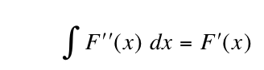

Welcome to the wiki for F Prime Prime (FPP). FPP is a domain-specific modeling language for the
https://fprime.jpl.nasa.gov[F Prime flight software framework].

To use FPP, you write a model in the source language;
then you use the FPP tools to generate C++ and JSON.
FPP provides a clean and succinct syntax, a well-defined semantics, robust error checking and reporting,
and tight integration between the model and the generated code.

== Our Motto

This motto, derived from the Fundamental Theorem of Calculus, explains the name F Prime Prime, or FPP:

* By "`integrating`" an F&Prime; model (i.e., running the FPP tools), you
get an F&prime; deployment that is partially implemented.
* By "`integrating`" the generated F&prime; deployment (i.e., completing the implementation),
you get a FSW application.

== For Users and Implementers

* https://nasa.github.io/fpp/fpp-users-guide.html[User's Guide]
* https://github.com/nasa/fpp/wiki/Tools[Tools]
* https://github.com/nasa/fpp/wiki/Code-Generation[Code Generation]

== Primarily for Implementers

* https://nasa.github.io/fpp/fpp-spec.html[Language Specification]
* https://github.com/nasa/fpp/wiki/Analysis[Analysis]
* https://github.com/nasa/fpp/wiki/Pure-Functional-Programming-in-Scala[Pure Functional Programming in Scala]
* https://github.com/nasa/fpp/wiki/Adding-New-Features-to-FPP[Adding New Features to FPP]
* https://github.com/nasa/fpp/wiki/F-Prime-and-FPP-Tandem-Development[F Prime and FPP Tandem Development]
